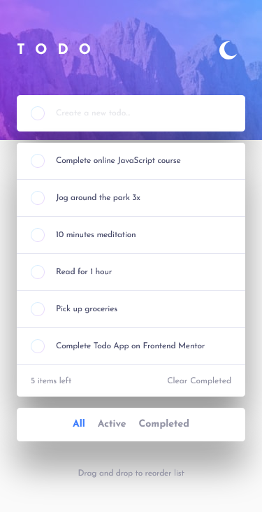
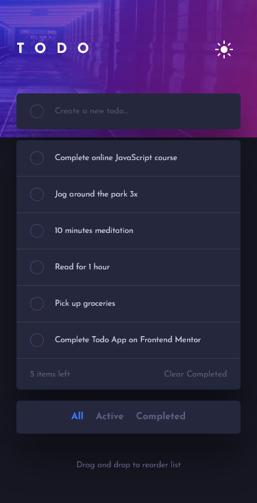
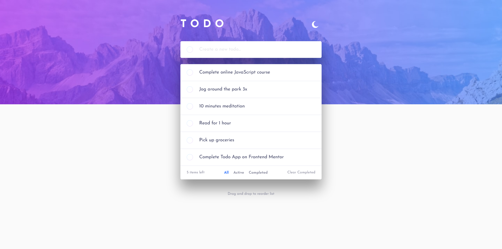
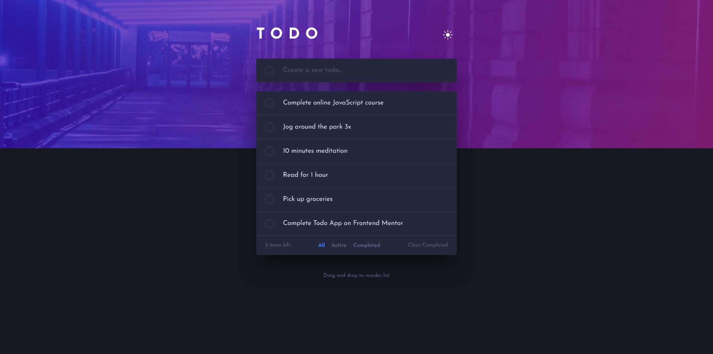

# Frontend Mentor - Todo app solution

This is a solution to the [Todo app challenge on Frontend Mentor](https://www.frontendmentor.io/challenges/todo-app-Su1_KokOW). Frontend Mentor challenges help you improve your coding skills by building realistic projects.

## Table of contents

- [Overview](#overview)
  - [The challenge](#the-challenge)
  - [Screenshot](#screenshot)
  - [Links](#links)
- [My process](#my-process)
  - [Built with](#built-with)
  - [What I learned](#what-i-learned)
  - [What next in this project](#what-next-in-this-project)
  - [Useful resources](#useful-resources)
- [Author](#author)

## Overview

### The challenge

Users should be able to:

- View the optimal layout for the app depending on their device's screen size
- See hover states for all interactive elements on the page
- Add new todos to the list
- Mark todos as complete
- Delete todos from the list
- Filter by all/active/complete todos
- Clear all completed todos
- Toggle light and dark mode
- **Bonus**: Drag and drop to reorder items on the list

### Screenshots

### Links

- Solution URL: [Frontend Mentor Solution Page](https://www.frontendmentor.io/solutions/todo-app-vanilla-js-VwuTrkt6Fk)
- Live Site URL: [GitHub Pages Site](https://karolbanat.github.io/fem-todo-app/)

## My process

### Built with

- Semantic HTML5 markup
- CSS custom properties
- Flexbox
- CSS Grid
- Mobile-first workflow
- Vanilla JS

### What I learned

Learned some new things about drag and drop API.
I completed that challenge without any JS frameworks, with Vanilla JS. It was hard, expecially managing the task data. At the beggining my files were a complete mess, but later I somehow divided it into separate files. I still think it could look better, and will work on improving it.

### What next in this project

I am planning to adding some things and improvements to this project:

- Adding buttons to task to allow to reorder with keyboard navigation, as alternative to drag and drop
- Some animations
- Refactoring JavaScript files
- ...

### Useful resources

MDN articles:

- [MDN Drag and Drop API](https://developer.mozilla.org/en-US/docs/Web/API/HTML_Drag_and_Drop_API)
- [MDN dragstart event](https://developer.mozilla.org/en-US/docs/Web/API/HTMLElement/dragstart_event)
- [MDN dragover event](https://developer.mozilla.org/en-US/docs/Web/API/HTMLElement/dragover_event)
- [MDN drop event](https://developer.mozilla.org/en-US/docs/Web/API/HTMLElement/drop_event)
- [MDN insertAdjacentElement method](https://developer.mozilla.org/en-US/docs/Web/API/Element/insertAdjacentElement)

## Author

- Frontend Mentor - [@karolbanat](https://www.frontendmentor.io/profile/karolbanat)
